# AWS IoT Q&A

On this page a few questions and answers are listed that have been come across during researching the possibilities of AWS IoT.

## **What happens when I select a few things and a whole group at the same time?**

When you only select these two, and the luminis-vgds group:

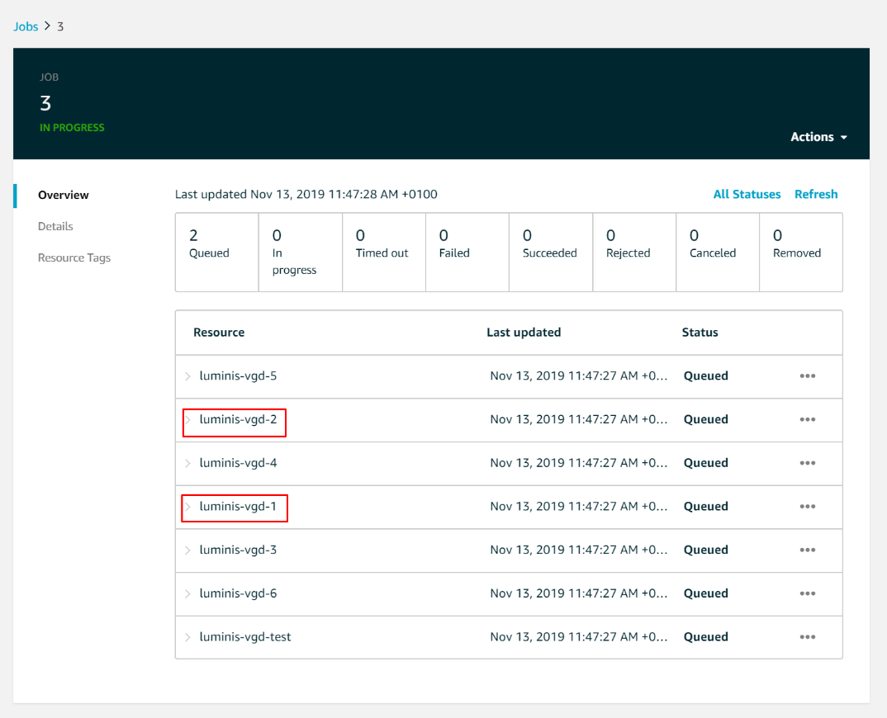

Then you can see, the job will be queued for all the things/devices in the group. These devices are attached to the group:

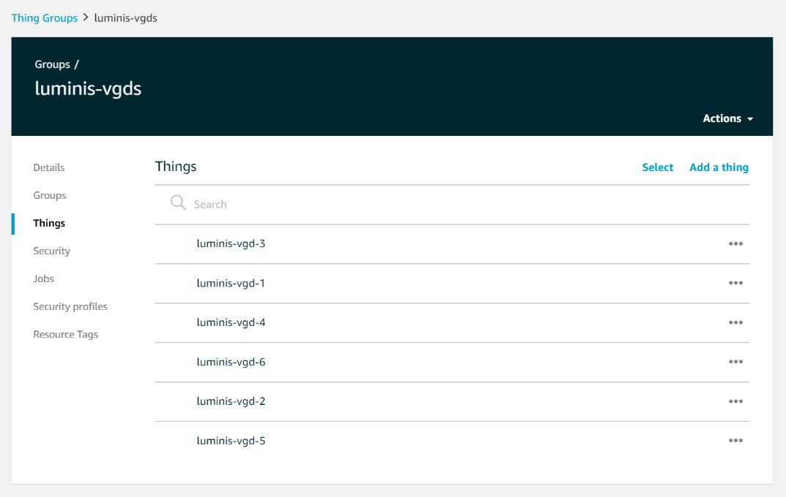

## **Can I roll out firmware and/or bootloader updates on FreeRTOS?**

For certain I only found that you can roll out firmware updates. Bootloader updates should also be possible, but that might be a little bit harder to do.

Links:

* [https://www.digikey.com/en/articles/techzone/2018/may/updating-firmware-at-the-edge-using-amazon-freertos](https://www.digikey.com/en/articles/techzone/2018/may/updating-firmware-at-the-edge-using-amazon-freertos)
* [https://www.embedded-computing.com/embedded-computing-design/over-the-air-firmware-upgrades-for-internet-of-things-devices](https://www.embedded-computing.com/embedded-computing-design/over-the-air-firmware-upgrades-for-internet-of-things-devices)

## Can a download be resumed using the AWS IoT job platform?

Yes, this should be possible, as I have tested multi-part downloads, although I do not have a working example of this.

## Can partial downloads be supported, is it included in the Javascript SDK example job agent?

When the download gets aborted in one way or another we probably want to provide a mechanism to continue the download later on. Scenario's can be:

* There is temporarily no internet connection established between the device and the server.
* There is temporarily no internet connection at all.

By default it's not available in the example jobs agent, but it is possible to extend this functionality in order to support it.

## **Will a job document be continuously sent when a device disconnects?**

Yes, while a job status is 'IN\_PROGRESS' and has not been timed out yet:

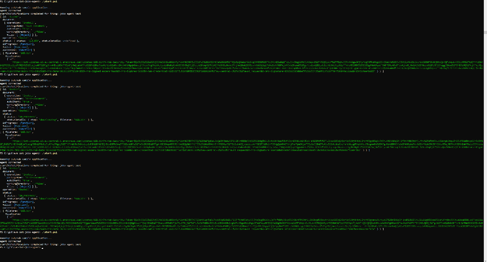

The client will receive a MQTT message. This is handled through functions or methods in the AWS IoT SDKs.

## **Can I see whether or not a device is connected to AWS IoT?**

Yes

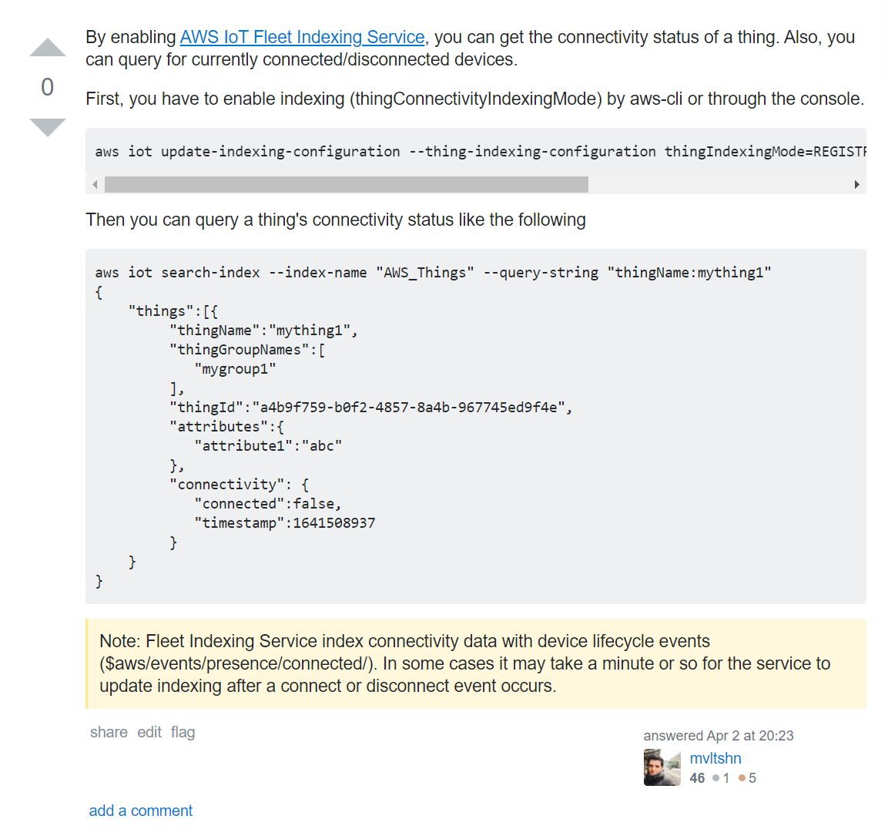

Source: [stackoverflow](https://stackoverflow.com/a/55483011/6385742)

## **Will the pre-signed URL still be available after downloading the resource from S3?**

Yes, there is just a set time limit that you can set when defining a job using the pre-signed url config.

This means that when you want another behavior, you might have to program that yourself if it is possible to invalidate the token manually.

## How do state changes occur in the IoT jobs feature?

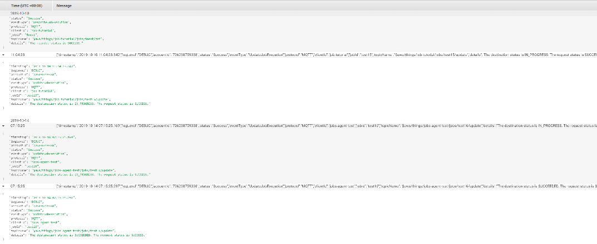

First there is a job request status, that is either successful or unsuccessful.

Second there is a destination status. Destination refers to the thing that the job is being sent to. This indicates the state the device is in regarding the job.

The state changes are dictated by the device and are sent to the AWS IoT cloud through the SDK that is being used.

## Does CloudWatch logging provide all the information about the state of a thing?

No, cloudwatch logging is very limited for AWS IoT. To give one example, for greengrass functions there is no logging at all.

## Does the job "working directory" need to exist BEFORE downloading a file?

This depends on the job agent, but using the example agent it is mandatory to manually add the logic to create a folder before downloading a file or manually creating it.

## Can an AWS IoT job be restarted after it has been completed, but wasn't picked up on with the device?

It seems that the device reports to AWS whether or not it received the job document. When the device crashes, the AWS platform will only know that the job was "IN\_PROGRESS" and it will be waiting for the device to send a status update. 

The job won't be automatically restarted. If the device didn't save the job document after crashing, it will be helpless to carry out the job.

## How does AWS compare to Azure and Google Cloud?

When it comes to the general overview, Google cloud seems to be more focused on collecting and processing of data.   
[Azure](https://docs.microsoft.com/en-us/azure/iot-hub/iot-hub-device-management-overview) has a lot features for device management and focusses a lot on that. They also have a feature where you can export and import the devices that you create. The only other outstanding feature that they seem to have is different pricing tiers. This could be useful when budgeting is a high priority.

The main feature Azure has that we might need opposed to AWS is tracking the progress of actions \(jobs\) that are running on devices remotely.

Amazon mostly focuses on delivering it's own OS's they do this with FreeRTOS and Greengrass. This is useful for working with the devices and the software on them. It is also a killer product that won't be included in the other cloud providers soon, because FreeRTOS is exlusively from AWS.

## How can a job be created using the AWS CLI?

Reference: [https://docs.aws.amazon.com/en\_pv/iot/latest/developerguide/manage-job-cli.html](https://docs.aws.amazon.com/en_pv/iot/latest/developerguide/manage-job-cli.html)

aws iot create-job --job-id test41 --targets arn:aws:iot:eu-central-1:726238759338:thing/jobs-agent-test --document-source https://iot-updates.s3.eu-central-1.amazonaws.com/bigger-file-test.json --presigned-url-config "{\"roleArn\":\"arn:aws:iam::726238759338:role/IoT-Jobs\", \"expiresInSec\":3600}" --region eu-central-1

## How can other types of jobs be executed?

All sorts of jobs can be executed by supplying another job document \(json\). All you have to do is change the document source to a different file.

The following job instructions are a common practice, but multiple can be configured:

* shutdown
* reboot
* install
* systemStatus
* stop
* start
* reboot

### Shutdown job

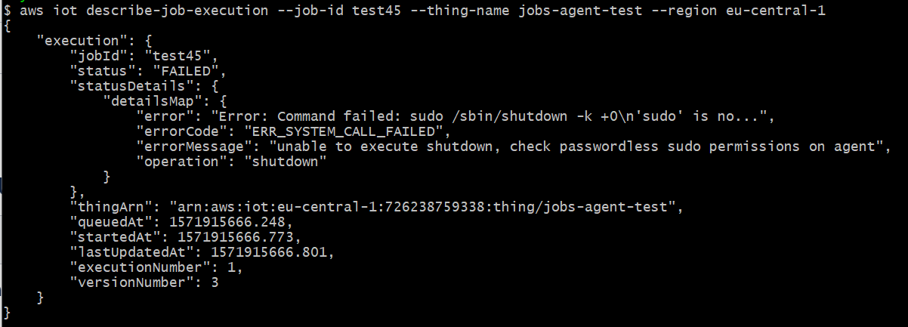

The jobs-agent example has a custom-made handler that will execute a command when it receives a shutdown job command. The test machine doesn't have the right permissions configured to execute the shutdown.

### Reboot job

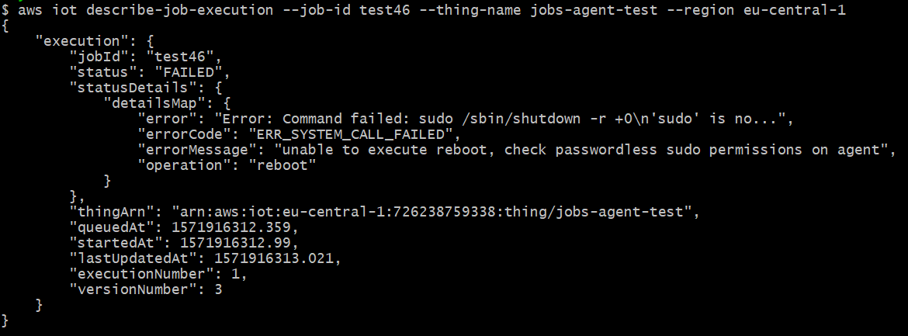

Same as with the shutdown command, the system isn't configured with the correct permission, but the different job type can be handled.

## Does Amazon simple storage service \(S3\) support Etags?

Yes, there will be an ETag available in the response headers from a request to S3:

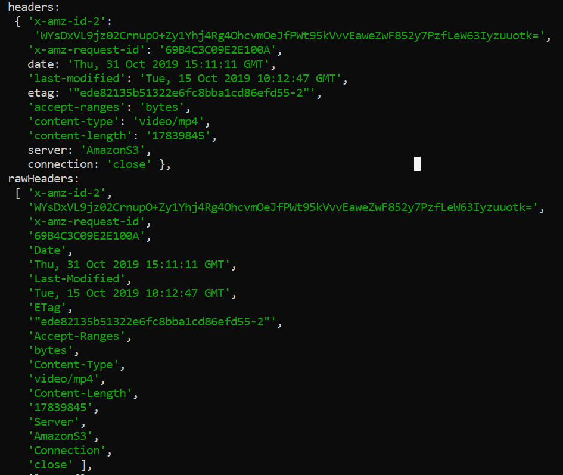

This is tested in the sample jobs agent that is available in the Javascript SDK.

## Can a thing be removed from a continuous job via an update?

No, you can only POST new targets: [https://docs.aws.amazon.com/iot/latest/apireference/API\_AssociateTargetsWithJob.html](https://docs.aws.amazon.com/iot/latest/apireference/API_AssociateTargetsWithJob.html)

## Can a new thing be associated with a continuous job?

No, only thing groups can be associated with continuous jobs.

## Does Amazon simple storage service \(S3\) support if-modified-since & last modified?

Yes:

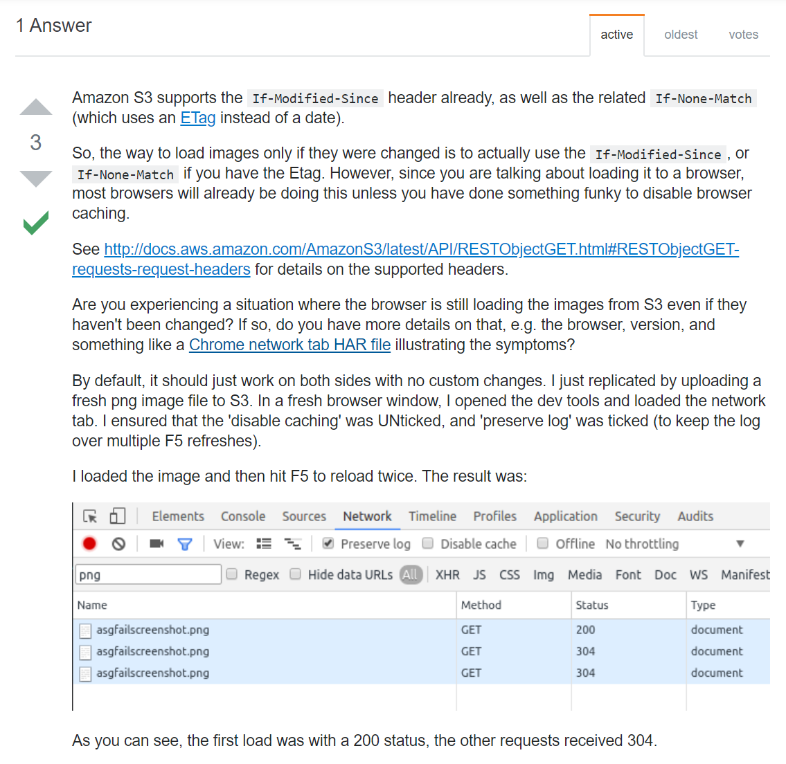

As found [here](https://stackoverflow.com/a/39054118/6385742).

There seem to be [four options available](http://qsupport.quantum.com/kb/flare/Content/lattus/REST%20Guide/Request_Headers_for_GET_.htm) to check whether or not a file has been changed:

* If-Match: return the object if its entity tag \(ETag\) is the same as the one specified, or return HTTP 412 \(precondition failed, XML response\).
* If-None-Match: return the object if its entity tag \(ETag\) is different from the one specified, or return HTTP 304 \(object not modified\).
* If-Unmodified-Since: return the object if it has not been modified since the specified time, or return HTTP 412 \(precondition failed, XML response\).
* If-Modified-Since: return the object if it has been modified since the specified time, or return HTTP 304 \(object not modified\).

## Can the IoT platform be reached through direct calls on the API?

Yes, they can be reached over HTTPS. There are two ports, a legacy one \(8443\) and the standard HTTPS port 443.

API Reference: [https://docs.aws.amazon.com/en\_pv/iot/latest/apireference/Welcome.html](https://docs.aws.amazon.com/en_pv/iot/latest/apireference/Welcome.html)

There are a couple of different categories, with each their own base URL:

* AWS IoT → [https://iot.eu-central-1.amazonaws.com/](https://iot.eu-central-1.amazonaws.com/) → "Service name" can be empty
* AWS IoT Data Plane → [https://a313umob4e5h7t-ats.iot.eu-central-1.amazonaws.com/things/jobs-agent-test/shadow](https://a313umob4e5h7t-ats.iot.eu-central-1.amazonaws.com/things/jobs-agent-test/shadow) → "Service name" = iotdata
* AWS IoT Jobs Data Plane → [https://iot.eu-central-1.amazonaws.com/things/jobs-agent-test/jobs/test40](https://iot.eu-central-1.amazonaws.com/things/jobs-agent-test/jobs/test40) → "Service name" = execute-api

In Postman you can add authorization through an Accesskey and SecretKey:

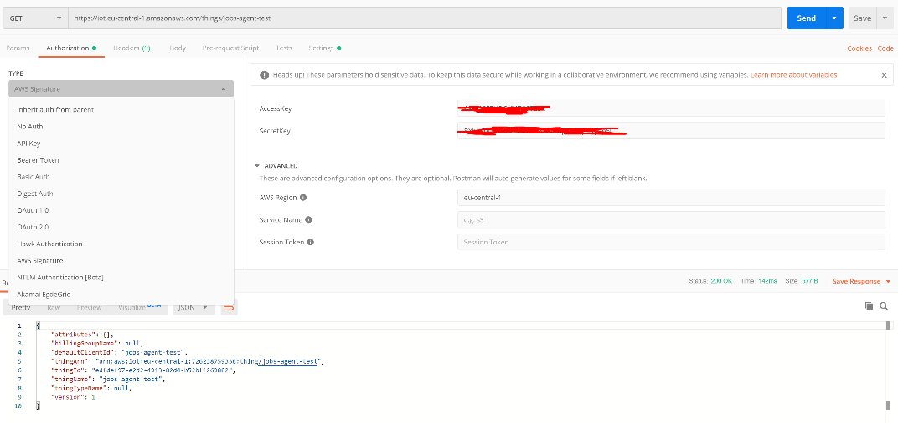

The service name in the above list can be set in the advanced section of this screen.

## How would creating a job through the HTTP look like?

It will look like executing a PUT request to [https://iot.eu-central-1.amazonaws.com/jobs/test47](https://iot.eu-central-1.amazonaws.com/jobs/test47). In this example we will do it in postman.

When we fill in all the required information, we get the following error message from the API "Target arn jobs-agent-test is an invalid ARN."

This is because we supplied a thing name instead of an ARN. That is a disadvantage of using the HTTP API opposed to the CLI, because this will take extra work looking up the ARN's manually.

It's only a small disadvantage because the ARN is based on a few factors that can be constructed based on variables. Programmatically it will be way easier to find the ARN.

When filling in the information correctly, we get the following result:

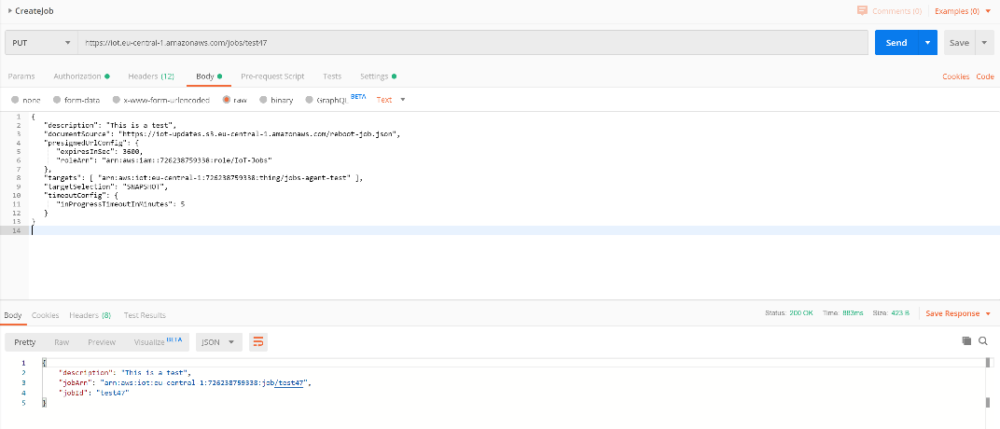

## Is it possible to listen to job events when publishing to those events is turned off?

No, publishing needs to be turned on in order to gain the permission to subscribe:

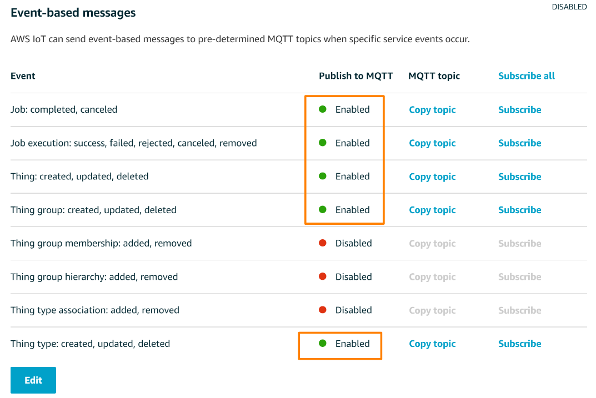

Only those topics that are marked will be enabled at the moment.

